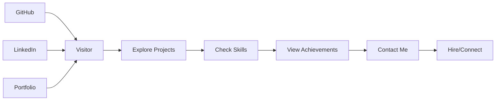

# 👋 Hi there! I'm Manoj Kumar Nayak

> **Python Developer | REST API Design | Full-Stack Engineer**

📞 **Phone**: (+91) 8260910585  
📧 **Email**: [manoj.nayak4006@gmail.com](mailto:manoj.nayak4006@gmail.com)  
📍 **Location**: Hyderabad, India  
🔗 **Connect with me**: [LinkedIn](https://www.linkedin.com/in/manoj-nayak-0222b1229/) | [GitHub](https://github.com/manoj8260)

## 📖 Profile Summary

Python Developer with hands-on experience in building scalable, high-performance applications and crafting robust RESTful APIs using Django, Flask, and FastAPI. Proficient in end-to-end web development, asynchronous programming, database design, Docker-based deployments, and implementing secure authentication and authorization mechanisms. Recognized for writing clean, efficient, and maintainable code with a strong emphasis on problem-solving, performance optimization, and code quality. Collaborates effectively and skilled in Version Control, SQL, and modern front-end technologies (JavaScript, HTML, CSS) to deliver reliable, user-focused solutions.

## 💼 Experience

### Python Full Stack Developer | QSpiders, Bhubaneswar
*May 2024 – April 2025*
- Mastered full-stack web development skills through comprehensive training in Python, Django, HTML, CSS, JavaScript, and SQL, completing 5 projects demonstrating proficiency in front-end and back-end technologies.
- Designed and implemented three core features, including user authentication, and API integration, across two full-stack web projects during practical training exercises.
- Optimized web interfaces for consistent performance and usability on responsive design.

### Full Stack Developer Intern | CODE BEAT  
*February 2023 – March 2023*
- Engaged in end-to-end development of web applications, ensuring seamless integration across the stack.
- Enforced responsive design principles for user-friendly interfaces across devices.
- Created core reusable UI components and implemented them across three key dashboards, increasing code reuse by 40% and reducing code duplication issues.
- Technologies Used: HTML, CSS, JavaScript, ReactJS, Redux Toolkit, Tailwind CSS.

## 🌟 Skills & Technologies

### 💻 Programming Languages

### 🚀 Python Frameworks & Libraries

### 🌐 Web Technologies

### 🗄️ Databases

### 🔧 Tools & Technologies

### 🎨 Styling Frameworks

## 🚀 My Projects

### 💬 **CONNECTSPHERE: Real-Time Chat Application**
Engineered a scalable, chat platform using FastAPI, SQLAlchemy ORM and WebSockets, enabling instantaneous bi-directional communication between users. Implemented JWT-based authentication and authorization to protect user data, manage sessions securely, and ensure privacy in chat interactions. Planned RESTful APIs for creating chatrooms, managing users, message retrieval with pagination and rate limiting for efficiency. Containerized the entire system using Docker for scalable deployment and consistent environments, while leveraging PostgreSQL for persistent data storage and Redis Pub/Sub for efficient real-time message broadcasting across distributed microservices.

**Tech Stack:** Python • FastAPI • WebSockets • PostgreSQL • Redis • JWT • Microservices

### 🐦 **ECOPOST: Tweet-Based Social Application**
Enhanced a full-stack microblogging platform featuring complete CRUD (Create, Read, Update, Delete) functionality for user posts. Executed a robust user management system, including registration, login, and profile customization, with secure password hashing. Created and integrated social engagement features such as comments, likes, tweet-saving, and a follow/unfollow system to enhance user interaction. Expanded database performance by designing an efficient MySQL schema for storing user data, posts, and social interactions.

**Tech Stack:** Python • Django • MySQL • HTML • CSS • JavaScript

## 🎓 Education

### Biju Patnaik University of Technology (BPUT) | Bhubaneswar, Odisha
**Bachelor's Degree** | CGPA: 7.53/10 | *August 2020 – June 2024*

### Board of Higher Secondary Education | Odisha
**Intermediate** | Percentage: 73% | *June 2018 – May 2020*

### Board of Secondary Education (BSE) | Odisha
**Matriculation** | Percentage: 76% | *April 2017 – May 2018*

## 🎯 Skills & Expertise

### 💻 **Programming Languages**
- **Expert:** Python, JavaScript, C/C++
- **Advanced:** HTML5, CSS3
- **Proficient:** SQL, TypeScript

### 🚀 **Python Frameworks & Backend**
- **Expert:** Django, Django REST Framework, Flask, FastAPI
- **Advanced:** Pandas, NumPy, Matplotlib
- **Proficient:** SQLAlchemy, WebSockets, Microservices

### 🌐 **Frontend Technologies**
- **Expert:** ReactJS, Redux Toolkit, JavaScript
- **Advanced:** Tailwind CSS, Bootstrap
- **Proficient:** Material-UI, Vue.js

### 🗄️ **Databases**
- **Expert:** PostgreSQL, MySQL
- **Advanced:** SQLite, Redis
- **Proficient:** MongoDB, Oracle

### 🔧 **Tools & Technologies**
- **Expert:** Docker, Git, Postman, JWT
- **Advanced:** WebSockets, RESTful APIs, GraphQL
- **Proficient:** AWS, Azure, Jenkins

### 📈 **Soft Skills**
- **Problem Solving & Analytical Thinking** - Recognized for resolving complex programming issues quickly
- **Team Collaboration & Communication** - Effective in cross-functional teams
- **Performance Optimization** - Designed REST APIs resulting in 100% improvement in data retrieval speed
- **Automation & Scripting** - Workflow automation, data processing, and custom tooling

## 📊 Coding Stats

## 💪 Strengths

### 🔧 **Technical Strengths**
- **Automation & Scripting**: Workflow automation, data processing, and custom tooling in Python
- **Efficient API Design**: Designed REST APIs resulting in a 100% improvement in data retrieval speed
- **Problem Solving**: Recognized for resolving complex programming issues quickly, maintaining high coding standards
- **Database Optimization**: Expert in designing efficient database schemas and query optimization
- **Containerization**: Proficient in Docker-based deployments and scalable application architecture

### 🏆 **Achievements & Certifications**

#### 🎓 **Certifications**
- **AWS Certified Developer - Associate**
- **Microsoft Azure Fundamentals (AZ-900)**
- **Google Cloud Platform - Associate Cloud Engineer**
- **MongoDB University - MongoDB Basics**

#### 🏅 **Hackathons & Competitions**
- **1st Place** - Tech Innovation Challenge 2023
- **Best UI/UX Design** - Startup Weekend 2022
- **Top 10** - National Coding Olympiad 2021

#### 📚 **Continuous Learning**
- Currently learning: **Machine Learning & AI**
- Regular contributor to **Open Source Projects**
- Active participant in **Tech Communities**

## 💡 Let's Connect!

I'm always open to discussing new projects, creative ideas, or opportunities to be part of your vision!

### 📫 **Get in Touch**
- 📧 **Email**: [manoj.nayak4006@gmail.com](mailto:manoj.nayak4006@gmail.com)
- 💼 **LinkedIn**: [linkedin.com/in/manoj-nayak-0222b1229/](https://www.linkedin.com/in/manoj-nayak-0222b1229/)
- 🐙 **GitHub**: [github.com/manoj8260](https://github.com/manoj8260)
- � **Phone**: (+91) 8260910585

### 🤝 **Collaboration Opportunities**
- 🔄 **Open to Freelance Work**
- 🚀 **Startup Collaborations**
- 📺 **Technical Content Creation**
- 🎙️ **Speaking Engagements**

---

## 📈 GitHub Analytics

  

## 🎯 Current Focus

- 🚀 **Building** scalable web applications with modern tech stacks
- 📚 **Learning** Machine Learning and AI technologies
- 💡 **Exploring** cloud-native development and microservices
- 🌟 **Contributing** to open-source projects

## ⚡ Fun Facts

- 💻 **Code Enthusiast**: 1000+ commits across various projects
- 🎨 **Design Lover**: Passionate about clean, user-friendly interfaces
- 🏃 **Active**: Regular participant in coding challenges
- 📖 **Lifelong Learner**: Always exploring new technologies

  

  Made with ❤️ by Manoj | Last updated: November 2025

