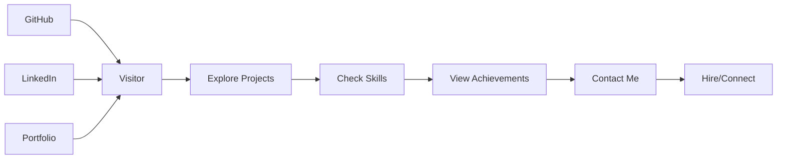

# 👋 Hi there! I'm Manoj

> **Full-Stack Developer | Tech Enthusiast | Problem Solver**

📧 **Email**: manoj.yourmail@example.com  
📍 **Location**: India  
🔗 **Connect with me**: [LinkedIn](https://linkedin.com/in/manoj) | [GitHub](https://github.com/manoj8260)

## 📖 About Me

I'm a passionate Full-Stack Developer with expertise in building modern, scalable web applications. I love turning complex problems into simple, beautiful designs. My journey in programming has equipped me with a diverse skill set across multiple technologies and frameworks.

## 🌟 Languages & Technologies

### 💻 Programming Languages

### 🌐 Web Technologies

### 🗄️ Databases

### ☁️ Cloud & DevOps

### 🎨 Styling & Frameworks

## 🚀 My Projects

### 💼 **E-Commerce Web Application**
A full-stack e-commerce platform built with React, Node.js, and MongoDB. Features include user authentication, product catalog, shopping cart, and payment integration.

**Tech Stack:** React • Node.js • Express • MongoDB • Stripe API  
**Key Features:** JWT Authentication • Real-time Inventory • Responsive Design  
**[View Project](https://github.com/manoj8260/ecommerce-app)**

### 📊 **Task Management Dashboard**
A modern task management application with drag-and-drop functionality, real-time updates, and team collaboration features.

**Tech Stack:** React • TypeScript • Tailwind CSS • Firebase  
**Key Features:** Real-time Sync • Team Collaboration • Progress Tracking  
**[View Project](https://github.com/manoj8260/task-manager)**

### 🔍 **Weather Forecast App**
A responsive weather application providing real-time weather data and forecasts with beautiful visualizations.

**Tech Stack:** JavaScript • HTML5 • CSS3 • OpenWeather API  
**Key Features:** Location-based Weather • 7-day Forecast • Weather Charts  
**[View Project](https://github.com/manoj8260/weather-app)**

### 🎵 **Music Player Application**
A feature-rich music player with playlist management, audio visualization, and streaming capabilities.

**Tech Stack:** React • Redux • HTML5 Audio • Spotify API  
**Key Features:** Playlist Management • Audio Visualizer • Crossfade  
**[View Project](https://github.com/manoj8260/music-player)**

## 🎯 Skills & Expertise

### 💻 **Frontend Development**
- **Expert:** React, JavaScript, HTML5, CSS3
- **Advanced:** TypeScript, Tailwind CSS, Bootstrap
- **Proficient:** Vue.js, Angular, Material-UI

### 🚀 **Backend Development**
- **Expert:** Node.js, Express, RESTful APIs
- **Advanced:** MongoDB, PostgreSQL, GraphQL
- **Proficient:** Python (Django), Java (Spring Boot)

### 🔧 **Tools & Technologies**
- **DevOps:** Docker, AWS, Git, GitHub Actions
- **Testing:** Jest, Mocha, Cypress
- **Design:** Figma, Adobe XD, Sketch

### 📈 **Soft Skills**
- Problem Solving & Analytical Thinking
- Team Collaboration & Communication
- Agile Development & Project Management
- Continuous Learning & Adaptability

## 📊 Coding Stats

## 🏆 Achievements & Certifications

### 🎓 **Certifications**
- **AWS Certified Developer - Associate**
- **Microsoft Azure Fundamentals (AZ-900)**
- **Google Cloud Platform - Associate Cloud Engineer**
- **MongoDB University - MongoDB Basics**

### 🏅 **Hackathons & Competitions**
- **1st Place** - Tech Innovation Challenge 2023
- **Best UI/UX Design** - Startup Weekend 2022
- **Top 10** - National Coding Olympiad 2021

### 📚 **Continuous Learning**
- Currently learning: **Machine Learning & AI**
- Regular contributor to **Open Source Projects**
- Active participant in **Tech Communities**

## 💡 Let's Connect!

I'm always open to discussing new projects, creative ideas, or opportunities to be part of your vision!

### 📫 **Get in Touch**
- 📧 **Email**: [manoj.yourmail@example.com](mailto:manoj.yourmail@example.com)
- 💼 **LinkedIn**: [linkedin.com/in/manoj](https://linkedin.com/in/manoj)
- 🐙 **GitHub**: [github.com/manoj8260](https://github.com/manoj8260)
- 📱 **Portfolio**: [manoj-portfolio.com](https://manoj-portfolio.com)

### 🤝 **Collaboration Opportunities**
- 🔄 **Open to Freelance Work**
- 🚀 **Startup Collaborations**
- 📺 **Technical Content Creation**
- 🎙️ **Speaking Engagements**

---

## 📈 GitHub Analytics

  

## 🎯 Current Focus

- 🚀 **Building** scalable web applications with modern tech stacks
- 📚 **Learning** Machine Learning and AI technologies
- 💡 **Exploring** cloud-native development and microservices
- 🌟 **Contributing** to open-source projects

## ⚡ Fun Facts

- 💻 **Code Enthusiast**: 1000+ commits across various projects
- 🎨 **Design Lover**: Passionate about clean, user-friendly interfaces
- 🏃 **Active**: Regular participant in coding challenges
- 📖 **Lifelong Learner**: Always exploring new technologies

  

  Made with ❤️ by Manoj | Last updated: November 2025

