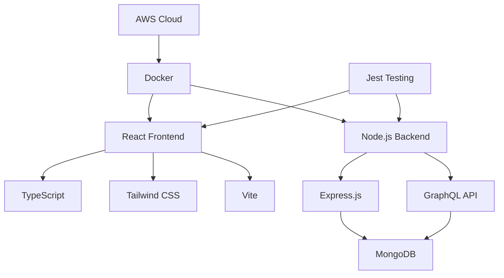
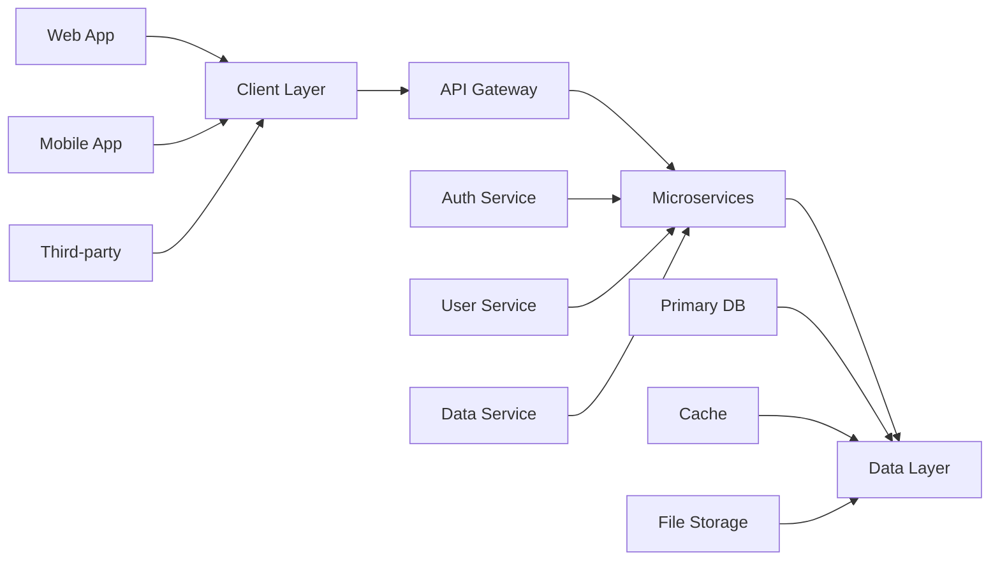

# 🚀 NexusFlow - Modern Web Application


> **Empowering seamless digital experiences through innovative web solutions**

## ✨ Overview

NexusFlow is a cutting-edge web application designed to revolutionize how users interact with digital platforms. Built with modern technologies and best practices, it offers a smooth, responsive, and feature-rich experience across all devices.

## 🛠️ Technology Stack

### Frontend


### Backend


### DevOps & Tools




## 🎯 Key Features

### 🚀 **Real-time Updates**
- Live data synchronization
- WebSocket integration
- Instant notifications

### 📱 **Responsive Design**
- Mobile-first approach
- Cross-browser compatibility
- Progressive Web App (PWA) features

### 🔒 **Security First**
- JWT authentication
- Role-based access control
- Data encryption
- Input validation

### ⚡ **Performance Optimized**
- Lazy loading
- Code splitting
- CDN integration
- Database indexing

### 🔧 **Developer Friendly**
- Comprehensive API documentation
- Modular architecture
- Extensive test coverage
- Hot reloading

## 📊 Architecture Overview



## 🚀 Quick Start

### Prerequisites
- Node.js (v18 or higher)
- MongoDB (v4.4 or higher)
- Git

### Installation

1. **Clone the repository**
```bash
git clone https://github.com/your-username/nexusflow.git
cd nexusflow
```

2. **Install dependencies**
```bash
# Install frontend dependencies
cd frontend && npm install

# Install backend dependencies  
cd ../backend && npm install
```

3. **Environment setup**
```bash
# Copy environment files
cp .env.example .env

# Configure your environment variables
PORT=5000
MONGODB_URI=mongodb://localhost:27017/nexusflow
JWT_SECRET=your-secret-key
```

4. **Start the application**
```bash
# Start backend server
cd backend && npm start

# Start frontend development server
cd frontend && npm run dev
```

🌐 **Visit [http://localhost:3000](http://localhost:3000) to view the application!**

## 📖 Usage Examples

### Making API Requests
```javascript
// Example: Fetch user data
import { apiClient } from './utils/api';

const fetchUserData = async (userId) => {
  try {
    const response = await apiClient.get(`/users/${userId}`);
    return response.data;
  } catch (error) {
    console.error('Error fetching user:', error);
  }
};
```

### Authentication
```javascript
// Example: Login with credentials
import { authService } from './services/auth';

const handleLogin = async (email, password) => {
  try {
    const token = await authService.login(email, password);
    localStorage.setItem('token', token);
    // Redirect to dashboard
  } catch (error) {
    console.error('Login failed:', error);
  }
};
```

## 🎨 Screenshots

### Dashboard Overview


### Mobile Responsive


### Dark Mode


## 🧪 Testing

Run the test suite:

```bash
# Frontend tests
cd frontend && npm test

# Backend tests
cd backend && npm test

# End-to-end tests
npm run test:e2e
```

## 📈 Performance Metrics

- **Load Time**: < 2s
- **First Contentful Paint**: < 1s
- **Time to Interactive**: < 3s
- **Bundle Size**: < 1MB gzipped
- **Test Coverage**: > 90%

## 🔧 Contributing

We welcome contributions! Please see our [Contributing Guide](CONTRIBUTING.md) for details.

### Development Workflow
1. Fork the repository
2. Create your feature branch (`git checkout -b feature/amazing-feature`)
3. Commit your changes (`git commit -m 'Add amazing feature'`)
4. Push to the branch (`git push origin feature/amazing-feature`)
5. Open a Pull Request

## 📄 License

This project is licensed under the MIT License - see the [LICENSE](LICENSE) file for details.

## 🙏 Acknowledgments

- Built with ❤️ using modern web technologies
- Inspired by community best practices
- Special thanks to all contributors

## 📞 Support

- 📧 **Email**: support@nexusflow.com
- 💬 **Slack**: [join our community](https://slack.nexusflow.com)
- 📖 **Documentation**: [docs.nexusflow.com](https://docs.nexusflow.com)
- 🐛 **Issues**: [GitHub Issues](https://github.com/your-username/nexusflow/issues)

---

<p align="center">
  
</p>

<p align="center">
  <sub>Made with ❤️ by the NexusFlow Team</sub>
</p>
